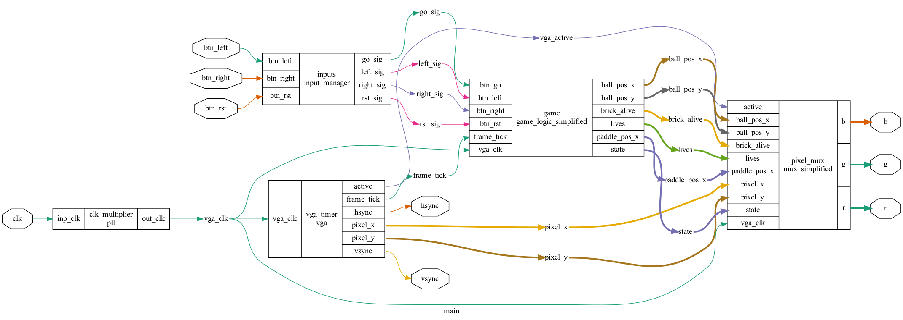

# FPGA Brick Breaker

A hardware implementation of the classic Brick Breaker game, written entirely in Verilog and targeting an iCE40HX1K FPGA board with VGA output.

## Overview

This project generates the video signal and game logic for Brick Breaker directly in FPGA hardware. A clock generator and PLL derive the correct pixel clock from the board oscillator, horizontal/vertical counters drive VGA sync timing, and a game logic module will track the paddle, ball, and bricks to render the play field. A Python-based simulation script allows the VGA output to be checked against a waveform dump before it's tested on real hardware.

## Tech Stack

- **Verilog** — all game logic and video timing hardware modules
- **iCE40 FPGA toolchain** — [Apio](https://apio-doc.readthedocs.io/) wrapping Yosys (synthesis), nextpnr (place & route), and IceStorm (bitstream generation)
- **Python** — `vga_sim.py` with `pyvcd`/`vcdvcd` to inspect simulated VGA output from waveform dumps
- **Icarus Verilog** — for running the testbench in simulation before synthesizing to hardware

## Hardware

- iCE40HX1K - 1,280 Logic Cells, PMOD Connectors, 12MHz clock, on-board PLL
- [Tiny VGA PMOD](https://github.com/mole99/tiny-vga) - Plugs into the J2 PMOD port on the iCEstick, with inputs of a 2 bit red, green and blue channel alongside hsync and vsync values for the VGA timing. It outputs to a female VGA port.
- VGA to HDMI Adapter - Has a male VGA port on one side and a female HDMI port on the other. Requires power through a USB cable to support adapter.
- Breadboard - Connect the left, right, and reset buttons to the ports on the iCEstick.

## Module Design
 

 
The design is organized around three main submodules driven by a single `clk` input:
 
- **`vga_timer`** takes the board clock and produces the pixel clock (`vga_clk`), the active-video flag, sync signals (`hsync`/`vsync`), and the current scan position (`pixel_x`/`pixel_y`).
- **`game_logic`** takes the button inputs (`btn_go`, `btn_left`, `btn_right`, `btn_rst`) and the per-frame tick from the timer, and outputs the current game state — ball position, brick status, lives, paddle position, and score.
- **`pixel_mux`** combines the timer's pixel position with the game state to decide what should be drawn at each pixel, producing the final `b`/`g`/`r` color outputs.
- **`input_manager`** takes the button inputs and turns them from active low to active high for the rest of the game logic. The go button is also wired to clicking both the left and right button at the same time.

`main` wires these three modules together, so `vga_active`, `frame_tick`, `pixel_x`, and `pixel_y` all flow from the timer into both `game_logic` and `pixel_mux`, while `game_logic`'s outputs feed into `pixel_mux` to be rendered. The color outputs as well as `hsync` and `vsync` are outputted through the PMOD pins to a VGA adapter.

## Challenges

The original design consisted of a title screen, an info bar that showed how many lives left and the score. However to run this on the iCE40HX1K, the design had to be simplified. To get Logic Cell utilization from 250% to 95%, all of the text displays had to be removed.
